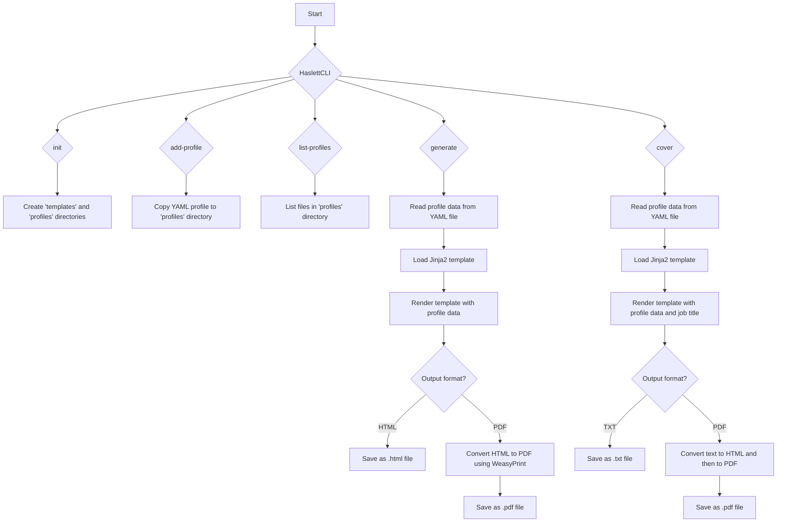

# HaslettCLI Workflow Explanation

This flowchart illustrates the functionality of the `haslettcli.py` script, a command-line tool for generating CVs and cover letters.

1. **Start**: The user executes the `haslettcli.py` script from the command line.

2. **HaslettCLI**: The main entry point of the application, powered by the `click` library. The user can choose one of the available commands: `init`, `add-profile`, `list-profiles`, `generate`, or `cover`.

3. **`init` command**:
    * This command initializes a new project structure.
    * It creates two directories: `templates` and `profiles`. The `templates` directory will hold the Jinja2 templates for the CV and cover letter, and the `profiles` directory will store the YAML files with the user's professional data.

4. **`add-profile` command**:
    * This command adds a new profile to the project.
    * It takes the path to a YAML file as an argument and copies it to the `profiles` directory.

5. **`list-profiles` command**:
    * This command lists all the available profiles.
    * It reads the contents of the `profiles` directory and prints the filenames.

6. **`generate` command**:
    * This command generates a CV.
    * It reads the specified profile data from a YAML file in the `profiles` directory.
    * It loads the Jinja2 CV template (`cv_template.html.j2`).
    * It renders the template with the data from the profile.
    * The user can choose the output format:
        * **HTML**: The rendered content is saved as an `.html` file.
        * **PDF**: The rendered HTML is converted to PDF using the `WeasyPrint` library, and the output is saved as a `.pdf` file.

7. **`cover` command**:
    * This command generates a cover letter.
    * It reads the specified profile data from a YAML file in the `profiles` directory.
    * It loads the Jinja2 cover letter template (`cover_template.txt.j2`).
    * It renders the template with the data from the profile and the job title provided by the user.
    * The user can choose the output format:
        * **TXT**: The rendered content is saved as a `.txt` file.
        * **PDF**: The rendered text is first converted to HTML and then to PDF using `WeasyPrint`. The output is saved as a `.pdf` file.

